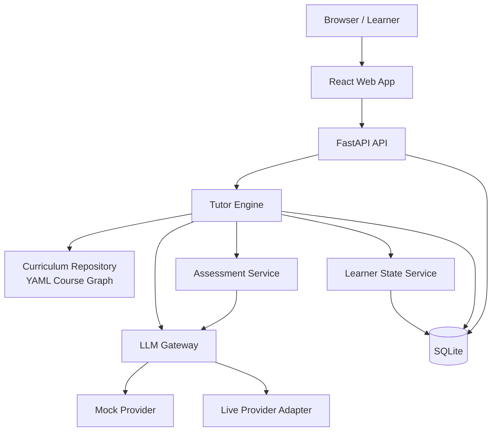
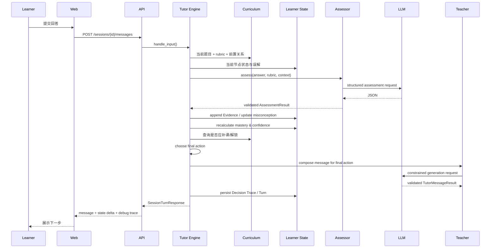

# InfraTutor V0.1 系统架构

## 1. 架构原则

1. **Tutor Engine 是核心，LLM 是可替换能力。**
2. **教学决策可测试。** 核心流程不能依赖真实模型才能运行。
3. **课程事实由人工数据定义。** LLM 负责理解与表达，不成为唯一事实源。
4. **状态变化可追溯。** 每次变化均关联 Evidence 与 Decision Trace。
5. **单体优先。** V0.1 使用前后端分离的本地单体，不引入微服务。
6. **结构化边界。** 所有影响程序逻辑的 LLM 输出必须通过 schema 校验。

## 2. 总体组件图



## 3. 组件职责

### 3.1 Frontend

负责：

- Roadmap 展示。
- Tutor 对话和题目交互。
- Learner State 的人类可读展示。
- 调试面板。
- Reset / Demo 控制。

不负责：

- 直接保存 API Key。
- 计算 Mastery。
- 决定下一教学动作。
- 直接调用模型厂商 API。

### 3.2 FastAPI API Layer

负责：

- HTTP 请求验证。
- 会话与事务边界。
- 调用应用服务。
- 把内部对象转为前端 DTO。
- 统一错误响应。

不得把复杂教学规则写在路由函数中。

### 3.3 Tutor Engine

负责：

- 读取当前节点、课程前置、Learner State 和本轮评估。
- 生成候选动作。
- 使用确定性优先级选出最终动作。
- 选择补课节点或下一节点。
- 触发状态更新。
- 构造 Teacher LLM 所需上下文。
- 保存 Decision Trace。

Tutor Engine 是产品的主要领域逻辑。

### 3.4 Curriculum Repository

负责：

- 读取 YAML。
- 校验节点 ID、前置关系、assessment 引用。
- 提供图查询：
  - 获取节点。
  - 获取前置节点。
  - 获取未掌握的最近前置节点。
  - 判断节点是否可解锁。
  - 获取推荐下一节点。

V0.1 可在启动时将 YAML 读入内存，不需要图数据库。

### 3.5 Learner State Service

负责：

- 读取和保存每个节点的学习状态。
- 写入不可变 Evidence。
- 更新 misconception 状态。
- 按规则计算 mastery、confidence 和 UI status。
- 判断掌握门槛是否成立。

### 3.6 Assessment Service

负责：

- 根据当前题目 rubric 构造 Assessor 请求。
- 调用 `LLMGateway.assess_answer()`。
- 校验 `assessment_output.schema.json`。
- 拒绝课程中不存在的 ID。
- 在模型失败时执行重试或降级。

### 3.7 LLM Gateway

统一接口示例：

```python
class LLMGateway(Protocol):
    async def assess_answer(self, request: AssessmentRequest) -> AssessmentResult:
        ...

    async def compose_tutor_message(
        self, request: TutorMessageRequest
    ) -> TutorMessageResult:
        ...
```

实现：

- `MockLLMGateway`：自动化测试和无 Key 演示。
- `LiveLLMGateway`：调用配置的外部模型。

上层不得依赖具体厂商消息格式。

### 3.8 Persistence

SQLite 保存：

- Learner。
- Session。
- Node State。
- Evidence。
- Misconception State。
- Conversation Turn。
- Decision Trace。

课程 YAML 仍是课程定义的唯一来源，不复制为可编辑数据库内容。

## 4. 推荐后端模块边界

```text
backend/
├── app/
│   ├── main.py
│   ├── api/
│   │   ├── roadmap.py
│   │   ├── sessions.py
│   │   ├── learner.py
│   │   └── admin_demo.py
│   ├── core/
│   │   ├── config.py
│   │   ├── errors.py
│   │   └── logging.py
│   ├── curriculum/
│   │   ├── loader.py
│   │   ├── models.py
│   │   ├── validator.py
│   │   └── graph.py
│   ├── learner/
│   │   ├── models.py
│   │   ├── repository.py
│   │   ├── mastery.py
│   │   └── service.py
│   ├── tutor/
│   │   ├── actions.py
│   │   ├── engine.py
│   │   ├── policy.py
│   │   ├── context_builder.py
│   │   └── decision_trace.py
│   ├── llm/
│   │   ├── gateway.py
│   │   ├── mock_provider.py
│   │   ├── live_provider.py
│   │   ├── contracts.py
│   │   └── validation.py
│   ├── sessions/
│   │   ├── models.py
│   │   ├── repository.py
│   │   └── service.py
│   └── db/
│       ├── base.py
│       ├── models.py
│       └── migrations/
└── tests/
```

该结构是建议，不要求 Codex 为每个文件创建空壳。只有在代码确实需要时再拆分。

## 5. 推荐前端边界

```text
frontend/
├── src/
│   ├── pages/
│   │   ├── RoadmapPage.tsx
│   │   ├── TutorPage.tsx
│   │   └── LearnerStatePage.tsx
│   ├── components/
│   │   ├── RoadmapStage.tsx
│   │   ├── KnowledgeNodeCard.tsx
│   │   ├── TutorMessage.tsx
│   │   ├── QuestionRenderer.tsx
│   │   └── DecisionDebugPanel.tsx
│   ├── api/
│   ├── types/
│   └── app/
└── tests/
```

## 6. 一次评估型回合的数据流



## 7. API 草案

### `GET /api/roadmap`

返回九阶段结构、节点状态和可用性。

### `GET /api/learner`

返回默认学习者的面向 UI 状态摘要。

### `POST /api/sessions/start`

请求：

```json
{
  "mode": "learn",
  "target_node_id": "memory_registration"
}
```

响应包含 session ID、实际起始节点和首条 Tutor 消息。若前置不足，实际节点通常与目标不同；课程若人工声明 target diagnostic probe，可先对目标做一次诊断，再转入前置补课。

### `POST /api/sessions/{session_id}/messages`

请求：

```json
{
  "content": "我认为 MR 会把内存复制到 HCA。",
  "question_id": "mr_q1_copy_check"
}
```

响应示例：

```json
{
  "turn_id": "...",
  "student_message": "我们先回到 DMA 和内存页固定……",
  "interaction_type": "remediation",
  "current_node_id": "device_dma",
  "question": null,
  "state_delta": {
    "memory_registration": {
      "status_before": "learning",
      "status_after": "learning"
    }
  },
  "debug": {
    "final_action": "REMEDIATE",
    "target_node_id": "device_dma",
    "reason_codes": [
      "CRITICAL_MISCONCEPTION_DETECTED",
      "WEAK_PREREQUISITE"
    ]
  }
}
```

### `POST /api/demo/reset`

重置默认学习者、会话与演示数据。

### `POST /api/demo/seed-golden-path`

可选开发接口，为 Golden Path 写入固定初始状态。

## 8. 数据库实体草案

### Learner

- `id`
- `display_name`
- `created_at`
- `preferences_json`

### LearningSession

- `id`
- `learner_id`
- `mode`
- `target_node_id`
- `current_node_id`
- `return_stack_json`
- `expected_question_id`
- `status`
- `created_at`
- `updated_at`

`return_stack_json` 用于补课后返回原目标，例如：

```json
["memory_registration"]
```

### LearnerNodeState

- `learner_id`
- `node_id`
- `status`
- `mastery_score`
- `confidence_score`
- `evidence_weight`
- `attempts`
- `last_seen_at`
- `last_tested_at`
- `review_due_at`

### Evidence

- `id`
- `learner_id`
- `session_id`
- `node_id`
- `question_id`
- `evidence_type`
- `score`
- `weight`
- `assistance_level`
- `rubric_results_json`
- `created_at`

### LearnerMisconception

- `learner_id`
- `misconception_id`
- `node_id`
- `status`
- `first_seen_at`
- `last_seen_at`
- `resolved_at`
- `evidence_ids_json`

### ConversationTurn

- `id`
- `session_id`
- `role`
- `content`
- `question_id`
- `created_at`

### DecisionTrace

- `id`
- `session_id`
- `turn_id`
- `assessment_json`
- `candidate_actions_json`
- `final_action`
- `target_node_id`
- `reason_codes_json`
- `state_delta_json`
- `created_at`

## 9. 错误与降级

### 9.1 LLM 输出不符合 schema

1. 使用验证错误构造一次修复重试。
2. 第二次仍失败：不写入 Evidence，不改变 Mastery。
3. 返回可恢复提示，并允许重试。
4. 记录错误但不记录密钥或完整敏感请求。

### 9.2 Live Provider 不可用

- 前端显示模型服务不可用。
- 可以切换 Mock 演示模式。
- 不伪造评估结果。

### 9.3 YAML 课程非法

应用启动失败并列出：重复 ID、循环依赖、未知引用或 assessment 缺失。不要带着不完整图继续运行。

### 9.4 用户问课程外问题

- Learn 模式：可简短回答，但提示与当前目标的关系，默认不改变 Mastery。
- 明显与课程无关：友好说明 V0.1 范围，并继续当前学习。

## 10. 安全与隐私边界

- `.env` 不提交仓库。
- API Key 不发送到浏览器。
- 禁止把内部资料复制进 curriculum 或 prompt。
- 用户输入是非可信文本，不能覆盖系统契约。
- Assessor 只允许返回课程中已有的 node、misconception、criterion ID。
- 数据本地保存；重置操作需要明确按钮确认。
