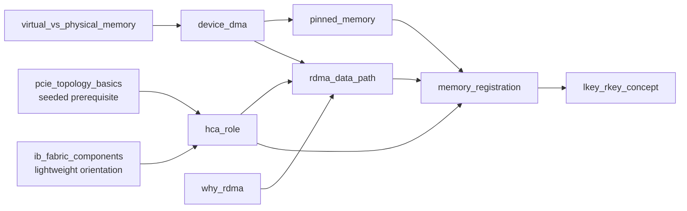

# InfraTutor 课程设计与知识图谱规范

## 1. 为什么使用知识图谱，而不是只有章节目录

章节目录回答“先展示哪一章”；课程知识图谱回答：

- 学会 X 前必须理解哪些节点？
- 学生在哪个具体前置点上出现缺口？
- 当前节点失败后应该回退到哪里？
- 哪些题目可以证明某个节点已经掌握？
- 一个知识点会在哪些后续任务中被再次使用？

V0.1 不需要 Neo4j。图由 YAML 中的节点与关系表达，后端加载为内存中的有向无环图。

## 2. 图中的基本对象

### 2.1 Stage

长期培训的九个阶段。Stage 主要用于路线展示和组织，不直接决定掌握度。

### 2.2 Knowledge Node

最小可追踪学习单位。一个好节点应当满足：

- 有清楚、可验证的学习目标。
- 通常能在 10～30 分钟内形成一次学习闭环。
- 可以设计问题或任务收集证据。
- 失败时能定位到更小的前置知识。

节点类型：

- `concept`：概念与心智模型。
- `skill`：可操作能力。
- `procedure`：一套执行流程。
- `lab`：真实或模拟实验。
- `checkpoint`：综合评估。

### 2.3 Edge

V0.1 支持的关系：

- `prerequisite`：学习 A 前通常需要掌握 B；Tutor Engine 用它做解锁和回退。
- `reinforces`：A 会再次强化 B；先作为元数据。
- `applies`：A 在任务 B 中被使用；先作为元数据。
- `recommended_next`：在多个可选后继中给出默认顺序。

只有 `prerequisite` 参与 V0.1 的硬性教学决策。

## 3. 完整九阶段知识结构

下面是首版人工课程骨架。它不是最终教材，而是后续持续细化的“地图”。详细机器可读版本见 `curriculum/roadmap.yaml`。

## 阶段 1：Shell / Slurm / C 基础

### 目标

让新人能够进入集群、理解作业资源、阅读和轻量修改测试程序，并知道程序在操作系统中的基本运行方式。

### 子图

```text
Linux 文件与权限
   ├── 重定向 / 管道
   ├── 环境变量 / PATH
   ├── SSH / SCP / rsync
   └── Shell 脚本

进程 / 信号
   ↓
Slurm 集群模型
   ↓
资源请求
   ↓
salloc / srun / sbatch
   ↓
作业日志与错误定位

C 内存模型
   ↓
指针 / 数组
   ↓
结构体 / 函数指针
   ↓
编译 / 链接 / Makefile 概览
```

### 关键节点

- Linux 文件、路径、权限。
- 重定向、管道与常用文本处理。
- 进程、PID、信号与前后台任务。
- 环境变量、动态库路径。
- SSH、SCP、rsync。
- Shell 脚本基础。
- Slurm 的 partition / node / job / step。
- CPU、内存、DCU 等资源请求。
- salloc、srun、sbatch 的区别。
- Job 状态、stdout/stderr 和典型配额错误。
- C 栈、堆、指针、数组、结构体。
- 编译、链接、动态库和 Makefile 的整体作用。

## 阶段 2：HIP / DCU

### 目标

建立 CPU 与 DCU 协作、Host/Device 内存和异构并行执行的整体框架，为理解跨设备与跨节点通信做准备。

### 子图

```text
加速器系统概览
   ├── CPU / DCU 执行分工
   │      ├── Kernel
   │      ├── Thread / Block / Grid
   │      └── 同步 / 错误模型
   ├── Host / Device 内存
   │      ├── 分配 / 拷贝
   │      └── Stream / Event
   └── PCIe / NUMA
          ↓
     设备拓扑检查
          ↓
     简单 HIP 程序与基础性能观察
```

### 关键节点

- CPU、DCU、显存、主存之间的关系。
- Host code 与 Kernel 的执行位置。
- Thread / Block / Grid 的基本映射。
- Host / Device 内存分配与拷贝。
- 同步、异步、Stream、Event。
- PCIe 链路、Root Complex、Switch 的概念。
- Socket、NUMA Node、Memory Locality。
- 查看 DCU 与网卡的拓扑关系。
- 能读懂并运行一个简单 HIP 程序。

## 阶段 3：InfiniBand / RDMA 理论

### 目标

理解节点间数据为什么能绕过传统 CPU 数据搬运路径、HCA 如何访问内存，以及 RDMA 抽象背后的资源与保护机制。

### 子图

```text
网络栈基础 ──→ 为什么需要 RDMA
                      │
IB Fabric 组件 ──→ HCA ──→ RDMA 数据路径
                           ↑          │
虚拟/物理内存 → DMA → Pinned Memory │
                           └──────────┘
                                      ↓
                              Memory Registration
                                      ↓
                                  lkey / rkey

RDMA 数据路径
   ├── Two-sided / One-sided
   ├── RC / UD 等传输概念
   ├── Completion 概念
   └── IB 地址与连接身份基础
```

### 关键节点

- TCP/IP 数据路径与 RDMA 动机。
- IB Fabric：HCA、Switch、Link、Port。
- 虚拟地址与物理页。
- DMA 的发起者、CPU 角色和数据位置。
- Pinned Memory 的必要性。
- HCA 在 PCIe、主存与网络之间的位置。
- RDMA 数据路径。
- Memory Registration。
- lkey / rkey 的保护与授权含义。
- One-sided 与 Two-sided。
- Completion 的意义。
- RC / UD 的基本差异。

## 阶段 4：RDMA Verbs

### 目标

把阶段 3 的抽象落到 verbs 对象、状态机和 API 调用，能够理解并修改基础 RDMA 程序。

### 子图

```text
Device Context
   ↓
Protection Domain
   ├── Memory Region
   ├── Completion Queue
   └── Queue Pair
          ↓
       QP 状态机
          ↓
 SGE / WR / WQE
          ↓
post_send / post_recv
          ↓
      CQ Polling
          ↓
 Send/Recv 与 RDMA Write/Read
          ↓
      Ping-pong Lab
```

### 关键节点

- Device list 与 Context。
- Protection Domain 的隔离作用。
- MR、CQ、QP 对象关系。
- RESET → INIT → RTR → RTS。
- SGE、WR、WQE。
- post_send / post_recv。
- Completion 与错误状态。
- Send/Recv。
- RDMA Write/Read 与权限。
- Connection metadata 交换。
- 基础 ping-pong 程序。

## 阶段 5：MPI

### 目标

理解分布式进程通信编程模型、常见通信语义和集合通信，并能在 Slurm 集群中运行与分析 MPI 程序。

### 子图

```text
Process / Rank
   ↓
Communicator
   ├── Point-to-Point
   │      ├── Blocking
   │      └── Nonblocking
   ├── Collective
   ├── Datatype
   └── Synchronization / Progress

Slurm 启动 → Rank Mapping → Transport Stack → 性能模型
```

### 关键节点

- Rank、World、Communicator。
- Blocking / Nonblocking P2P。
- Request、Wait、Progress。
- Broadcast、Reduce、AllReduce、AllGather 等集合通信。
- Datatype。
- 进程启动与 rank 到节点映射。
- MPI 与 UCX/OFI/共享内存等底层传输关系。
- 消息大小、延迟、带宽和同步对性能的影响。

## 阶段 6：UCX

### 目标

理解 UCX 如何在多种硬件与传输之间提供统一通信接口，并能查看传输选择、配置和常见性能问题。

### 子图

```text
UCS / UCT / UCP 分层
          ↓
Context → Worker → Endpoint
          ├── Tag
          ├── RMA
          └── Active Message

Memory Registration
Transport Selection
Eager / Rendezvous
Progress Model
Multi-rail / Topology
          ↓
MPI / 上层框架集成
```

### 关键节点

- UCX 三层结构与职责。
- Context、Worker、Endpoint。
- Memory Registration 与缓存思想。
- TLS / NET_DEVICES 等传输选择概念。
- Tag、RMA、AM。
- Eager 与 Rendezvous。
- Progress 模型。
- Multi-rail 与设备选择。
- ucx_info 等配置观察工具。
- MPI 与 UCX 的关系。

## 阶段 7：RCCL

### 目标

理解多 DCU / 多节点集合通信如何组织算法、通道和传输路径，能够运行 rccl-tests 并解释基础性能结果。

### 子图

```text
Collective Primitives
        ↓
通信量 / 成本模型
        ↓
RCCL 架构
   ├── Topology Discovery
   ├── Ring / Tree
   ├── Channels
   ├── Transport Paths
   └── Process / Device Mapping
        ↓
环境变量与 rccl-tests
        ↓
algbw / busbw
        ↓
日志、Tracing、多节点实验
```

### 关键节点

- AllReduce、Broadcast、AllGather、ReduceScatter。
- 集合通信数据量与步骤数。
- RCCL 拓扑发现。
- Ring、Tree 及适用场景。
- Channel。
- P2P、共享内存、网络传输路径。
- Rank、进程与 DCU 映射。
- 常用环境变量的作用层次。
- rccl-tests 参数与输出。
- algbw 与 busbw。
- 日志、Tracing 与瓶颈模式。

## 阶段 8：网络数据分析

### 目标

能够把 benchmark、系统计数器、拓扑和日志整理成可靠证据，识别异常并形成可复现报告。

### 子图

```text
Latency / Bandwidth 指标
          ↓
测量方法与基线
   ├── Linux / NIC / IB Counters
   ├── RCCL / MPI / UCX Logs
   ├── Topology Data
   └── 时间序列清洗
          ↓
可视化 → 异常规则 → 跨层关联 → 性能报告
```

### 关键节点

- 延迟、吞吐、消息率、利用率。
- Warm-up、重复次数、噪声与置信区间基础。
- Linux 网络和设备计数器。
- IB Port Counters 与错误计数。
- 日志结构化解析。
- 数据清洗与单位统一。
- 曲线、分布、热力图的选择。
- 异常检测的规则与上下文。
- 应用、通信库、OS、PCIe、网络多层关联。
- 可复现 benchmark 与报告。

## 阶段 9：网络设计与综合性能优化

### 目标

从业务通信模式出发，跨硬件拓扑、网络、运行时和集合通信算法进行设计、定位与优化。

### 子图

```text
Workload Communication Pattern
          ↓
需求 / SLO / 容量
          ↓
瓶颈模型
   ├── NUMA / PCIe Placement
   ├── Network Topology / Rail
   ├── Routing / Traffic Balance
   ├── Collective Algorithm
   └── Software Parameters
          ↓
实验设计 / A-B 对照
          ↓
Root Cause
          ↓
综合设计案例与评审
```

### 关键节点

- 数据并行、张量并行、流水并行等通信模式。
- 需求、SLO 和容量规划。
- 延迟与带宽上界估算。
- NUMA、PCIe、DCU、HCA 放置优化。
- Fat-tree、rail、超售等拓扑概念。
- 路由、拥塞与流量平衡。
- 集合通信算法选择。
- MPI / UCX / RCCL 参数调优。
- 基线、单变量实验、A/B 和回归验证。
- 跨层根因定位。
- 综合性能优化报告与设计评审。

## 4. V0.1 纵向切片

V0.1 只实现下面节点：



其中 `pcie_topology_basics`、`ib_fabric_components` 可作为简化前置说明或初始已知状态，不要求 V0.1 完整教学。

## 5. 节点编写规范

每个可学习节点至少包含：

```yaml
id: memory_registration
title: RDMA Memory Registration
stage_id: stage_3_ib_rdma_theory
type: concept
prerequisites:
  - device_dma
  - pinned_memory
  - hca_role
  - rdma_data_path
learning_objectives:
  - 解释为什么 HCA 访问用户内存前需要注册
canonical_facts:
  - 数据仍位于主机内存，不会因为 MR 自动复制到 HCA
common_misconceptions:
  - mr_copies_memory_to_hca
assessments:
  - mr_q1_copy_check
mastery_requirements:
  minimum_mastery_score: 0.8
```

## 6. 人工课程内容必须写到什么程度

人必须确定：

- 学习目标。
- 核心事实。
- 内容边界。
- 前置关系。
- 常见误解。
- 评估 rubric。
- 掌握门槛。

LLM 可以决定：

- 用哪种类比。
- 先问还是先讲。
- 当前解释长度。
- 如何根据学生刚才的话反馈。
- 在不改变事实的前提下换一种表达。

## 7. 内容边界与准确性

每个节点都应声明“V0.1 不展开什么”。例如 Memory Registration：

- V0.1 讲经典注册、页固定、地址转换与权限。
- 不深入 On-Demand Paging、FRMR、MR Cache、IOMMU 实现差异、厂商私有优化。
- 可以提示存在高级例外，但不能让例外破坏初学者的主模型。

## 8. 图校验规则

启动时必须检查：

- 所有 node ID 唯一。
- 所有 prerequisite 指向已存在节点。
- 图不存在 prerequisite 环。
- assessment ID 唯一且指向正确 node。
- misconception ID 在课程中有定义。
- `recommended_next` 不得指向自身。
- 所有 implemented 节点至少有一个 assessment。
- 所有可 Mastered 节点有明确 mastery requirement。
