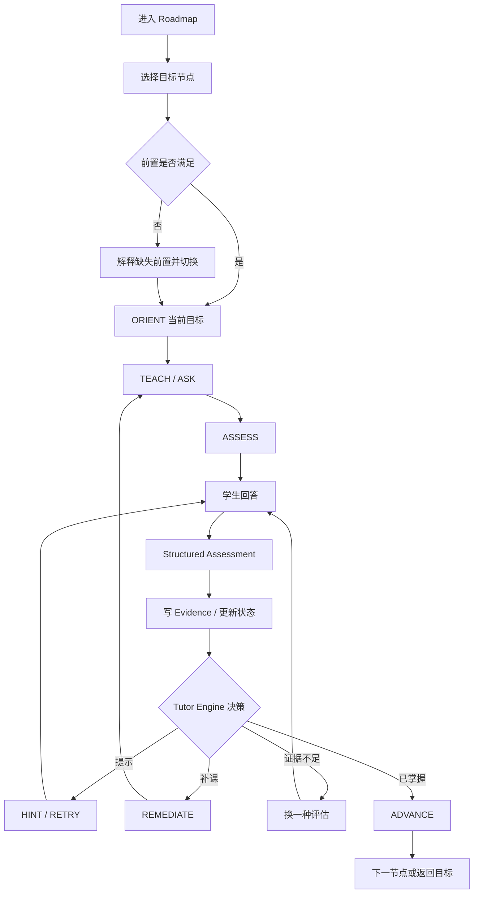

# InfraTutor V0.1 用户流程

## 1. 首次进入

用户打开本地 Web App：

```text
InfraTutor
面向高速互联新人的 AI 学习平台

[开始学习]  [体验 Golden Path]
```

首页展示九阶段路线。Stage 3 中的 V0.1 节点可点击，其余显示 `Coming Later`。

## 2. 正常学习流程



## 3. Golden Path 演示

### 3.1 初始状态

使用 Golden Path Seed：

```text
Virtual / Physical Memory   Mastered
Device DMA                  Partial
Pinned Memory               Partial
HCA Role                    Mastered
Why RDMA                    Mastered
RDMA Data Path              Partial
Memory Registration         Learning
lkey / rkey                 Locked
```

目标节点：`memory_registration`。

### 3.2 第一轮：暴露误解

Tutor：

> 你觉得 Memory Registration 会不会把用户 buffer 复制到 HCA 内部？请说明原因。

学生演示输入：

> 会。注册以后应该就是把这块内存复制到 HCA 里，这样网卡才能直接访问。

Assessor 应返回语义等价结果：

```json
{
  "understanding": "incorrect",
  "misconception_ids": ["mr_copies_memory_to_hca"],
  "missing_concept_ids": ["device_dma", "pinned_memory"]
}
```

Tutor Engine：

```text
final_action = REMEDIATE
target_node = device_dma
reason = critical misconception + weak prerequisite
return_stack = [memory_registration]
```

### 3.3 第二轮：补 DMA

Tutor 不直接给完整答案，而是问：

> 假设 CPU 配置好一次从主存到设备的 DMA 传输后，真正沿总线搬运数据的是 CPU 的复制循环，还是设备的 DMA 引擎？CPU 在传输期间能否继续做别的工作？

学生错误路径：

> 还是 CPU 自己复制，只是速度更快。

系统检测 `dma_is_cpu_memcpy`，继续停留在 DMA，先 TEACH/HINT，再问等价场景。

学生正确路径：

> CPU 负责配置描述符和启动，实际数据搬运由设备的 DMA 能力完成，CPU 不需要逐字节执行 memcpy，所以可以处理其他工作，最后再通过完成事件知道传输结果。

记录无提示或轻提示 Evidence。若还未满足 Mastered，追加一个场景题。

### 3.4 第三轮：补 Pinned Memory

Tutor：

> HCA 正在按已经建立的映射访问一组内存页。如果操作系统在中途把这些页换出或移动，可能发生什么？为什么要固定这些页？

学生正确说明：

- 设备正在使用的地址映射会失效或指向错误位置。
- 页固定保证访问期间物理页稳定。
- 固定本身不是把数据复制进 HCA。

Pinned Memory 获得解释和场景证据，进入 Mastered。

### 3.5 第四轮：返回 MR

系统弹出：

> 你已经补齐 DMA 和 Pinned Memory。现在回到最初的问题。

重新提出一个不同表述的 MR 解释题，避免仅凭记忆重复答案。

学生目标回答应包含：

- Buffer 数据仍在主机内存。
- 经典 MR 过程中，相关内存页在访问期保持可用/稳定。
- 系统为 HCA 建立访问所需的地址转换与保护信息。
- MR 生成或关联后续访问所需的 key。
- 不是把数据复制到 HCA。

### 3.6 第五轮：迁移题

Tutor：

> 程序注册了 buffer A，却把 buffer B 的地址作为发送 SGE，同时使用 A 的 lkey。为什么不能简单认为 HCA 会照常读取 B？

学生需要迁移到“注册范围、保护和 key 校验”的模型。

### 3.7 完成

满足 Mastered 门槛后：

```text
Memory Registration  Mastered
mr_copies_memory_to_hca  Resolved
lkey / rkey  Ready
```

Tutor 执行 `ADVANCE`，进入 `lkey_rkey_concept` 的 ORIENT。

用户应该直观感受到：

> 系统不是因为我点了继续而进入下一节，而是先发现错误模型、补前置、再用新题确认，最后才解锁后续知识。

## 4. 用户要求跳级

场景：MR 尚未 Mastered，用户点击 lkey/rkey。

系统：

- 不进入正式 lkey/rkey 学习。
- 展示“当前还缺少 Memory Registration 的访问保护模型”。
- 提供“完成一个快速检查”按钮。
- 由 Tutor Engine 进入 MR 评估。

不能仅显示一个灰色按钮而不给原因。

## 5. 学生反问

Tutor 正在问 DMA，学生说：

> DMA 和 `hipMemcpy` 是什么关系？

系统：

1. `ANSWER_SIDE_QUESTION`。
2. 用当前已允许事实解释 API 操作与底层数据搬运的关系。
3. 不写正式 Mastery Evidence。
4. 回到原 DMA 题，或给等价题防止照抄刚才答案。

## 6. 学生说“直接告诉我答案”

Tutor 可以分层处理：

1. 首次请求：给 light hint。
2. 再次请求：给 strong hint。
3. 明确需要答案：可以讲清楚，但记录 `answer_revealed`。
4. 随后必须换题重新评估；刚才听到答案不能作为 Mastered 证据。

## 7. 非法 LLM 输出

真实模型返回无法解析的内容时：

- 页面提示“本轮评估没有成功保存，请重新提交”。
- 当前学习状态不变化。
- 可在 Debug Panel 查看 `SCHEMA_VALIDATION_FAILED`。
- 不向用户展示堆栈或 API Key。

## 8. Roadmap 展示

建议视觉层级：

```text
Stage 1  Shell / Slurm / C                  Coming Later
Stage 2  HIP / DCU                          Coming Later
Stage 3  InfiniBand / RDMA 理论             In Progress
   ├─ Virtual / Physical Memory             Mastered
   ├─ Device DMA                            Partial
   ├─ Pinned Memory                         Partial
   ├─ HCA Role                              Mastered
   ├─ Why RDMA                              Mastered
   ├─ RDMA Data Path                        Partial
   ├─ Memory Registration                   Learning
   └─ lkey / rkey                           Locked
Stage 4  RDMA Verbs                         Coming Later
...
Stage 9  网络设计与综合性能优化               Coming Later
```

普通 UI 不显示 0.62、0.48 等内部数值。
